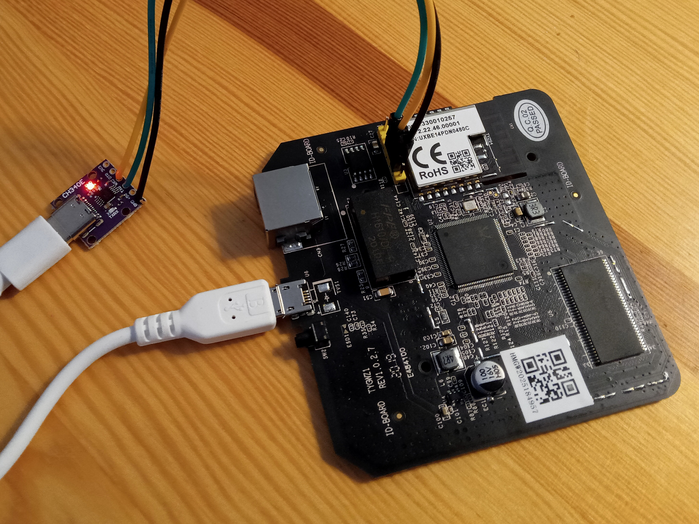

# Ohnutí Zigbee Gatewaye z Lojdlu

[Návod v češtině: www.elvisek.cz](https://www.elvisek.cz/2021/08/zigbee-modifikace-lidl-silvercrest-zb-gateway/)

---
## Zapojení sériové konzole:



USB - UART, 3.3V. Napájení není (3.3V) není třeba zapojovat. Pouze GND, TXD (na RXD) a RXD (na TXD).

Připojení sériového terminálu:

```
minicom -D /dev/ttyUSB0 -b 38400
```

Po zapnutí napájení se objeví bootovací výpis.

---
## Získání klíčů a root hesla:

Po zapnutí napájení zběsile mačkat ESC v sériovém terminálu. Tim se zastaví bootování a otevře nějaký debugovací režim (viz návod). Dále pokračovat příkazy:

```
FLR 80000000 401802 16
DW 80000000 4
FLR 80000000 402002 32
DW 80000000 8
```

### Celý výpis seance:

```
Booting...                                                                      
                                                                                
@@@@@@@@@@@@@@@@@@@@@@@@@@@@@@@@@@@@@@@@@@@@@@@@@@@@@@@@@@@@@@@@@@@@@@@@@@@@@@@@
@                                                                               
@ chip__no chip__id mfr___id dev___id cap___id size_sft dev_size chipSize       
@ 0000000h 0c84018h 00000c8h 0000040h 0000018h 0000000h 0000018h 1000000h       
@ blk_size blk__cnt sec_size sec__cnt pageSize page_cnt chip_clk chipName       
@ 0010000h 0000100h 0001000h 0001000h 0000100h 0000010h 000004eh GD25Q128       
@                                                                               
@@@@@@@@@@@@@@@@@@@@@@@@@@@@@@@@@@@@@@@@@@@@@@@@@@@@@@@@@@@@@@@@@@@@@@@@@@@@@@@@
DDR1:32MB                                                                       
                                                                                
---RealTek(RTL8196E)at 2020.04.28-13:58+0800 v3.4T-pre2 [16bit](380MHz)         
P0phymode=01, embedded phy                                                      
check_image_header  return_addr:05010000 bank_offset:00000000                   
no sys signature at 00010000!                                                   
                                                                                
---Escape booting by user                                                       
P0phymode=01, embedded phy                                                      
                                                                                
---Ethernet init Okay!                                                          
<RealTek>                                                                       
Unknown command !                                                               
<RealTek>FLR 80000000 401802 16                                                 
Flash read from 00401802 to 80000000 with 00000016 bytes        ?               
(Y)es , (N)o ? --> Y                                                            
Flash Read Successed!                                                           
<RealTek>DW 80000000 4                                                          
80000000:       3A3A452D        2A695478        6C787B39        225D2764        
<RealTek>FLR 80000000 402002 32                                                 
Flash read from 00402002 to 80000000 with 00000032 bytes        ?               
(Y)es , (N)o ? --> Y                                                            
Flash Read Successed!                                                           
<RealTek>DW 80000000 8                                                          
Unknown command !                                                               
<RealTek>DW 80000000 8                                                          
80000000:       66DAB315        5AB811AC        547FDC11        0A108BF8        
80000010:       DD7BB2E6        E739992F        9487175D        CCC5C98C        
<RealTek>
```

Výsledky tedy:

```
80000000:       3A3A452D        2A695478        6C787B39        225D2764        
80000000:       66DAB315        5AB811AC        547FDC11        0A108BF8        
80000010:       DD7BB2E6        E739992F        9487175D        CCC5C98C
```

[Pythoní skript pro dekódování hesla od elvisek.cz](https://www.elvisek.cz/wp-content/uploads/2021/08/lidl_auskey_decode.py)

Ten mi bohužel na Mintu nejede, asi protože mám pyton 3.10.x a v instalaci nového 3.14 mi brání starší openssl. Na Debianu mám 3.11.2, tak uvidíme.

~~Na obou mi ještě chyběla knihovna Crypto:~~ čti dál, toto nedělej 😉

```
pip install pycrypto
```

Asacra. Stejná chyba:

```
Traceback (most recent call last):
  File "/home/ondrej/Projekty/lidl_auskey_decode.py", line 61, in <module>
    cipher = AES.new(kek, AES.MODE_ECB)
             ^^^^^^^^^^^^^^^^^^^^^^^^^^
  File "/home/ondrej/.local/lib/python3.11/site-packages/Crypto/Cipher/AES.py", line 95, in new
    return AESCipher(key, *args, **kwargs)
           ^^^^^^^^^^^^^^^^^^^^^^^^^^^^^^^
  File "/home/ondrej/.local/lib/python3.11/site-packages/Crypto/Cipher/AES.py", line 59, in __init__
    blockalgo.BlockAlgo.__init__(self, _AES, key, *args, **kwargs)
  File "/home/ondrej/.local/lib/python3.11/site-packages/Crypto/Cipher/blockalgo.py", line 141, in __init__
    self._cipher = factory.new(key, *args, **kwargs)
                   ^^^^^^^^^^^^^^^^^^^^^^^^^^^^^^^^^
SystemError: PY_SSIZE_T_CLEAN macro must be defined for '#' formats
```

Takže se uchyluju k [originálnímu článku paulbanks.org](https://paulbanks.org/projects/lidl-zigbee/). ... jenže to vede ke stejnému skriptu...

Nakonec jsem se zeptal inteligenta, jak nahradit tu knihovnu (`from Cipher.Cipher import AES`). Ten napsal, že je to stara knihovna, navrhnul neadekvátní náhrady (když potřebuju jen funkci AES) ale nakonec mi poradil **nainstalovat knihovnu `pycryptodome`**, která řeší kompatibilitu.

```
pip install pycryptodome
```

A už to jede:

```
Enter KEK hex string line>80000000:       3A3A452D        2A695478        6C787B39        225D2764

b"11$'3NEoBocT4!?C"
31312427334e456f426f635434213f43

Encoded aus-key as hex string line 1>80000000:       66DAB315        5AB811AC        547FDC11        0A108BF8
Encoded aus-key as hex string line 2>80000010:       DD7BB2E6        E739992F        9487175D        CCC5C98C

b'f\xda\xb3\x15Z\xb8\x11\xacT\x7f\xdc\x11\n\x10\x8b\xf8\xdd{\xb2\xe6\xe79\x99/\x94\x87\x17]\xcc\xc5\xc9\x8c'
66dab3155ab811ac547fdc110a108bf8dd7bb2e6e739992f9487175dccc5c98c

Auskey: jj4yESTslJIAfU8yczYhZAB14kabMafY
Root password: 4kabMafY
```

Takže root password by mělo být **`4kabMafY`** (žeby pwgen 🤔).

---
## Přihlášení do konzole, spuštění ssh

Po resetu a bootu (výpis na konzoli) stisknout Enter (jinak to bude vypisovat nekonečné logy a errory). Výzva k přihlášení, jméno **root**, heslo **`4kabMafY`** (získané výše). Zázrak:

```shell
tuya-linux login: root
Password:
Tuya Linux version 1.0
Jan  1 00:02:25 login[121]: root login on 'console'
# 
```

Server ssh se aktivuje skriptem, který uloží stary spouštěč a nahradí jej prázdným (který asi nezabíjí ssh server).

```shell
if [ ! -f /tuya/ssh_monitor.original.sh ]; then cp /tuya/ssh_monitor.sh /tuya/ssh_monitor.original.sh; fi 
echo "#!/bin/sh" >/tuya/ssh_monitor.sh
```

Pak restart, zjištění IP adresy (třeba v sériové konzoli `ifconfig`) a přihlásit se přez síť, přes ssh. A další problém.

```bash
$ ssh root@192.168.1.121
Unable to negotiate with 192.168.1.121 port 22: no matching host key type found. Their offer: ssh-rsa,ssh-dss
```

Podle inteligenta to znamená, že server podporuje jen zabezpečení, které má můj klient už zakázané. Dočasně povolit `ssh-rsa` jde takto:

```bash
$ ssh -o HostKeyAlgorithms=+ssh-rsa -o PubkeyAcceptedAlgorithms=+ssh-rsa root@192.168.1.121
```

A sem tam.

Lepší by asi bylo vyrobit na serveru lepší certifikát. Zjistil jsem, že OS bude nejspíš BusyBox, takže ssh server bude `dropbear`.

```shell
# dropbear -V
Dropbear v2018.76
```

Jenže tento BusyBox nemá `dropbearkey` který by vygeneroval nové klíče, takže se musím spokojit s tím co tam je (ssh-rsa).

# Nahrazení původní aplikace Tuya

Dále dle návodu stáhnout [binnárku serialgateway.bin](https://www.elvisek.cz/wp-content/uploads/2021/08/serialgateway.bin), nahrát ji do krabičky ...

```bash
$ cat serialgateway.bin | ssh -o HostKeyAlgorithms=+ssh-rsa -o PubkeyAcceptedAlgorithms=+ssh-rsa root@192.168.1.121 "cat >/tuya/serialgateway"
```

... udělat spustitelnou ...

```shell
# chmod 755 /tuya/serialgateway
```

... vyměnit startovací skripty ...

```shell
# if [ ! -f /tuya/tuya_start.original.sh ]; then cp /tuya/tuya_start.sh /tuya/tuya_start.original.sh; fi
```

```shell
# cat >/tuya/tuya_start.sh <<EOF
#!/bin/sh
/tuya/serialgateway &
EOF
```

... a restart.

```shell
reboot
```

A protože se zdá, že to všechno funguje, tak co třeba update 🤔

# Update FW brány

Je třeba stáhnout [binárku firmware NCP_UHW_MG1B232_678_PA0-PA1-PB11_PA5-PA4.gbl](https://www.elvisek.cz/wp-content/uploads/2023/02/NCP_UHW_MG1B232_678_PA0-PA1-PB11_PA5-PA4.gbl), [flashovací skript firmware_upgrade.sh](https://www.elvisek.cz/wp-content/uploads/2023/02/firmware_upgrade.sh) a [jakousi binárku sx.bin](https://www.elvisek.cz/wp-content/uploads/2023/02/sx.bin), o které jsem nenašel co vlastně dělá ... divný.

Pak se přihlásit do gatewaye a vypnout službu serialgateway, aby netropila hlouposti.

```shell
# mv /tuya/serialgateway /tuya/serialgateway_norun
# killall serialgateway
```

Dále se pokusit o ten samotný upgrade:

```bash
./firmware_upgrade.sh 192.168.1.121 22 V7 NCP_UHW_MG1B232_678_PA0-PA1-PB11_PA5-PA4.gbl
```

Což ovšem selže.... Skript je ovšem tak pěkně napsaný, že alespoň hlášku *Successfully flashed new EZSP firmware! The device will now reboot.* vypíše vždy, aby nás to nemrzelo (nebo aby si to jeden rozmyslel).

1.  Záhadná binárka `sx.bin` musí být ve stejné adresáři se skriptem (a nejlíp i s firmwarem, ale to se dá nastavit).
2.  Upgradovací skript vytváří hned 3x ssh spojení, které selže z důvodů popsaných výše.

Je tedy třeba (to je takové nejsnazší řešení) upravit skript firmware_upgrade.sh tak, že za každé ssh přidáme ještě povolení rsa (`-o HostKeyAlgorithms=+ssh-rsa -o PubkeyAcceptedAlgorithms=+ssh-rsa`). Celý upravený skriptík pak vypadá takto:

```bash
#!/bin/bash
GATEWAY_HOST="$1"
SSH_PORT="$2"
FIRMWARE_FILE="$4"
EZSP_VERSION="$3"
CONFIGURATION_FRAME="\x00\x42\x21\xA8\x53\xDD\x4F\x7E"

if [ $EZSP_VERSION = "V8" ]; then
  CONFIGURATION_FRAME="\x00\x42\x21\xA8\x5C\x2C\xA0\x7E"
fi

cat sx.bin | ssh -o HostKeyAlgorithms=+ssh-rsa -o PubkeyAcceptedAlgorithms=+ssh-rsa -p${SSH_PORT} root@${GATEWAY_HOST} "cat > /tmp/sx"
cat ${FIRMWARE_FILE} | ssh -o HostKeyAlgorithms=+ssh-rsa -o PubkeyAcceptedAlgorithms=+ssh-rsa -p${SSH_PORT} root@${GATEWAY_HOST} "cat > /tmp/firmware.gbl"

ssh -o HostKeyAlgorithms=+ssh-rsa -o PubkeyAcceptedAlgorithms=+ssh-rsa -p${SSH_PORT} root@${GATEWAY_HOST} "
chmod +x /tmp/sx
killall -q serialgateway
stty -F /dev/ttyS1 115200 cs8 -cstopb -parenb -ixon crtscts raw
echo -en '\x1A\xC0\x38\xBC\x7E' > /dev/ttyS1
echo -en '$CONFIGURATION_FRAME' > /dev/ttyS1
echo -en '\x81\x60\x59\x7E' > /dev/ttyS1
echo -en '\x7D\x31\x43\x21\x27\x55\x6E\x90\x7E' > /dev/ttyS1
stty -F /dev/ttyS1 115200 cs8 -cstopb -parenb -ixon -crtscts raw
echo -e '1' > /dev/ttyS1
/tmp/sx /tmp/firmware.gbl < /dev/ttyS1 > /dev/ttyS1
reboot
"

echo "Successfully flashed new EZSP firmware! The device will now reboot."
```

Skriptík za běhu 3x vyžádá rootovslé heslo (to co jsme na začátku dolovali). To jak se připojuje. Poprvé nahrává záhadnou binárku, podruhé firmware a potřetí to vše spouští. Když to proběhne správně, vypadá to zhruba takto:

```bash
$ ./firmware_upgrade_rsa.sh 192.168.1.121 22 V7 NCP_UHW_MG1B232_678_PA0-PA1-PB11_PA5-PA4.gbl 
root@192.168.1.121's password: 
root@192.168.1.121's password: 
root@192.168.1.121's password: 
Sending /tmp/firmware.gbl, 1434 blocks: Give your local XMODEM receive command now.
Bytes Sent: 183680   BPS:6633                            

Transfer complete
Connection to 192.168.1.121 closed by remote host.
Successfully flashed new EZSP firmware! The device will now reboot.
```

Zařízení se pak chvíli vzpamatovává. Nyní je možné (vlastně nutné) znovu spustit servis ```serialgateway``` a zresetit.

```shell
# mv /tuya/serialgateway_norun /tuya/serialgateway
# reboot
```

Pokud to dobře dopadlo (mě asi ano), tak za pár chvil začne všechno znovu fungovat jako předtím ... Proč jsem to tedy vlastně dělal 🤔? No, každopádně sem rád, že to chodí.

---
## Závěr

Návod, jak ten český tak ten původní, jsou vesměs funkční a dopadlo to dobře. Je ovšem znát, že je ta krabička starší a taky ty návody. Pokud mám toto zařízení, tak jeho integrace do HA jako brány na ZigBee vůbec není špatná. Pro mě je největší výhodou takovéhle brány hlavně možnost umístit ji na jiné místo než HA, protože HA server mám v zastrčeném racku a to je pro výchozí bod ZigBee dost špatné místo.

Co tedy byly zádrhele:

1) Skript na dešifrování rootovského hesla
  - používá starší knihovnu pycrypto
  - nahradit pycryptodome, která způsobuje kompatibilitu
2) Server ssh (dropbear) podporuje jen staré zabezpečení
  - zabezpečení ssh-rsa dnes jizssh klienti odmítají
  - přidat do ssh příkazů povolení rsa
  - ```ssh -o HostKeyAlgorithms=+ssh-rsa -o PubkeyAcceptedAlgorithms=+ssh-rsa ...```

# Brána Tesla z Alzy

Kolega koupil [TESLA Smart RJ45 ZigBee Hub](https://www.alza.cz/tesla-smart-rj45-zigbee-hub-d7436417.htm?o=2). Po okamžité rozborce se zdá, že je to úplně stejný HW jako ta věc z Lidlu, jen krapet jiná krabička. Tak uvidíme ...

- je to skutečně Tuya
- bootloader je zamčený
- nejschůdnější cesta je prý SPI dump flash ...
