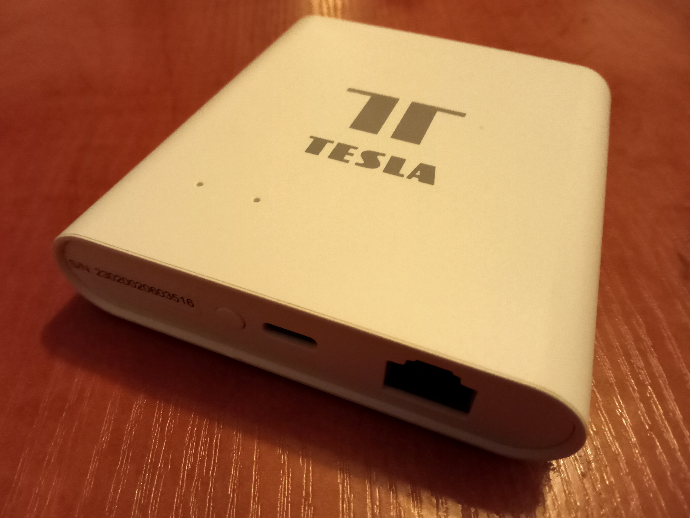

# ZigBee gateway Tesla - jailbreak trial

I recently got some ZigBee gateway Tesla, which my colleague bought very cheap on internet. We've foud out its the very same HW to Lidl/Silvecrest. I'll try to use the same aproach to its release from Tuya (or Tesla or whatever I don't want), to get my very own local access, to be able to use it as Home Assistant ZigBee gateway (ZHA, or ZigBee2MQTT).

The approach I've used on Lidl is here (czech) [postup pro Lidl Silvercrest](<Lidl (Tuya) SmartHome Gateway Ohýbání.md>). I was succesfull. Except some deails described in the notes, everything worked well.

Well, and here I'm working on new notes about [similar trial on Tesla gateway](<ZigBee gateway Tuya Tesla.md>). It's no done yet, but, maybe, promising.

There ase whole copies of the firmware images in this repo, including possible passwords. This way we can work on real data. I don't care much about those passowords, because in case of success, those passwords and images wouldn't be valid anymore. Like I did with the Lidl thing.

There is [lidl](lidl) directory in this repo too. It contain files and scripts used while Lidl/Silvercrest gateway hacking. The internet sources are described in the notes above.

The directory [tesla](tesla) contains packed flash content image and its checksum. To unpack you can use [unpack.sh](tesla/unpack.sh). Now I'm trying to find out what to put into the flash to [get the thing run](<ZigBee gateway Tuya Tesla.md>)..
