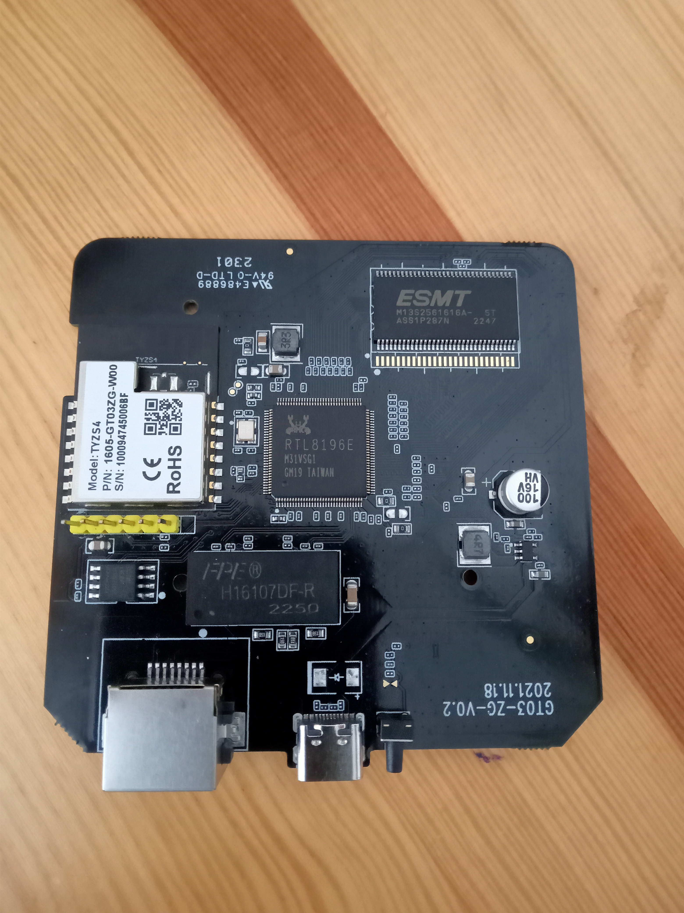
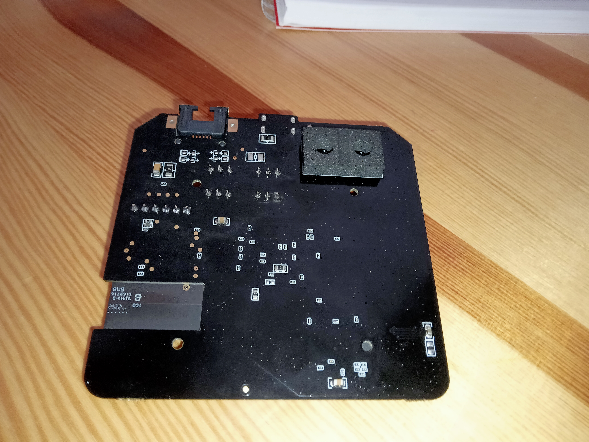
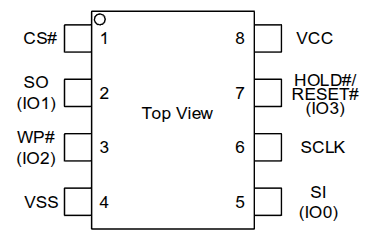
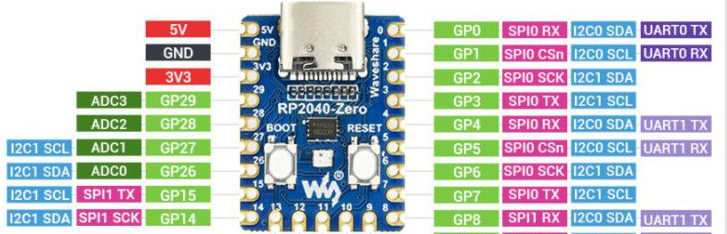
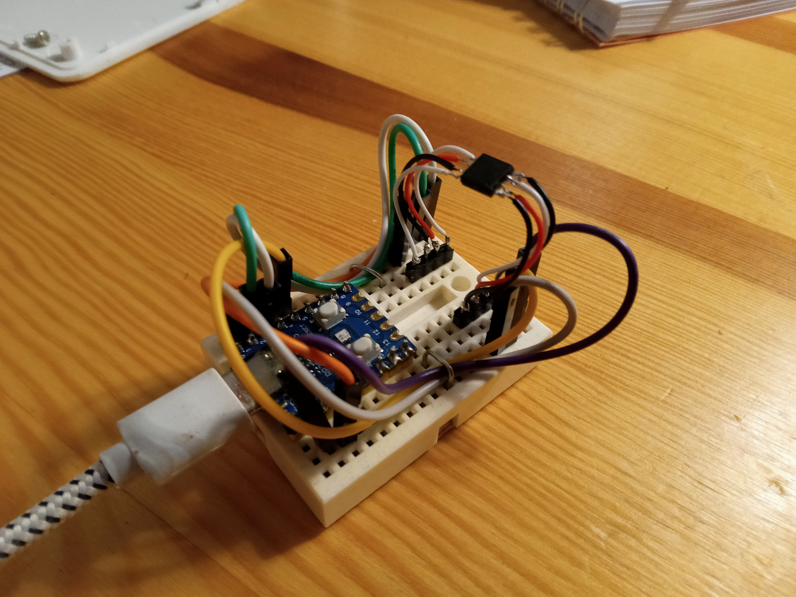

# Tesla ZigBee gateway

  


The PCB looks quite the same to Lidl/Silvercrest. I've hoped I can use the same path (czech) [Lidl gateway SilverCrest hacking](<Lidl (Tuya) SmartHome Gateway Ohýbání.md>). But I found out that the bootloader is locked, so its not posible to ESC it out. Seems there is only chance in SPI Flash Dump ... The flash chip is NOR Flash GigaDevice 25Q127CSIG.

I've found nice repo containing (seem so) whole new firmware for the device and the flashing procedure description: [github repo jnilo1/hacking-silvercrest-gateway](https://github.com/jnilo1/hacking-lidl-silvercrest-gateway). I don't have SSH access (otherwise I wouldn't do this). Can't stop bootloader with ESC, like I did last time with Lidl/Silvercrest. So remains the last option [Method 3 - SPI Programmer (CH341A or Equvivalen)](https://github.com/jnilo1/hacking-lidl-silvercrest-gateway/tree/main/3-Main-SoC-Realtek-RTL8196E/30-Backup-Restore#-method-3--spi-programmer-ch341a-or-equivalent). But I don't have the programmer. Never mind, let's try this: RP2040 zero [https://github.com/stacksmashing/pico-serprog](https://github.com/stacksmashing/pico-serprog)... damned, it's getting a bit complicated now ...

## Flash content backup

- [x] get hardware
	- breadboard
	- rp2040 zero

- [x] flash the programmer

```bash
git clone https://github.com/stacksmashing/pico-serprog.git
cd pico-serprog
mkdir build
cd build
cmake -DPICO_SDK_PATH=<path to pico sdk> ..
make
cp pico-serprog.u2f /media/.../RPI-RP2/
```

- [x] assemble the HW



| Pico GPIO | Function |
|-----------|----------|
| 1         | CS       |
| 2         | SCK      |
| 3         | MOSI     |
| 4         | MISO     |





### Testing flasher hardware and chip connection:

```bash
$ flashrom -p serprog:dev=/dev/ttyACM0:115200,spispeed=12M -c GD25Q127C/GD25Q128C
flashrom v1.2 on Linux 5.15.0-170-generic (x86_64)
flashrom is free software, get the source code at https://flashrom.org

Using clock_gettime for delay loops (clk_id: 1, resolution: 1ns).
serprog: Programmer name is "pico-serprog"
Found GigaDevice flash chip "GD25Q127C/GD25Q128C" (16384 kB, SPI) on serprog.
No operations were specified.
```

Yes. The is in the -p section, and the differend -c, device string. Because my version of flashrom doesn't know GD25Q128C ... But if you run it without specifiing the chip (without -c), It'll suggest to chose from two, where the first is GD25Q127C/GD25Q128C... And it looks like my GD25Q127C. So far so good.

### Flash chip backup:

```bash
$ flashrom -p serprog:dev=/dev/ttyACM0:115200,spispeed=12M -c GD25Q127C/GD25Q128C -r tesla_gateway_backup.bin
flashrom v1.2 on Linux 5.15.0-170-generic (x86_64)
flashrom is free software, get the source code at https://flashrom.org

Using clock_gettime for delay loops (clk_id: 1, resolution: 1ns).
serprog: Programmer name is "pico-serprog"
Found GigaDevice flash chip "GD25Q127C/GD25Q128C" (16384 kB, SPI) on serprog.
Reading flash... done.
```

```bash
$ ls -l tesla_gateway_backup.bin
-rw-rw-r-- 1 ... 16777216 ... tesla_gateway_backup.bin
```

Is it correct? Gues so. At least the content length fits.

## Find out Partition fitting to the backup image:

Look at [autopsy_of_backup.ipynb](tesla/autopsy_of_backup.ipynb). Long story short, it looks that it fits...

### Partition layout

At least I've found partition layout, thanks to [jnilo1/hacking-silvercrest-gateway](https://github.com/jnilo1/hacking-lidl-silvercrest-gateway).

Partition Layout
After migration (not my case yet):

```
0x000000-0x020000  mtd0  boot+cfg     (128 KB)   - Bootloader (unchanged)
0x020000-0x200000  mtd1  linux        (1.9 MB)   - Linux kernel
0x200000-0x420000  mtd2  rootfs       (2.1 MB)   - Root filesystem
0x420000-0x1000000 mtd3  jffs2-fs     (11.9 MB)  - User partition
```

- [x] take a look if the backup layout fits to the partitions
	- seems so

### The content of backup image with the focus on the partitions:

```
0x0000000: 0BF00004 00000000 00000000 00000000 00004021 40886000 00000000 3C01B800  ..................@!@.`.....<...
0x0000020: 00017825 8DEE0000 00000000 000E7025 3C018196 3421E000 00017825 15CF000A  ..x%..........p%<...4!....x%....
0x0000040: 00000000 3C0FB800 35EF0008 8DEE0000 2401FFFF 01C17024 3C010008 01C17025  ....<...5.......$.....p$<.....p%
0x0000060: ADEE0000 00000000 00000000 00000000 0FF000DA 00000000 00000000 3C013FFF  ............................<.?.
...
boot+cfg
...
0x001FF80: FFFFFFFF FFFFFFFF FFFFFFFF FFFFFFFF FFFFFFFF FFFFFFFF FFFFFFFF FFFFFFFF  ................................
0x001FFA0: FFFFFFFF FFFFFFFF FFFFFFFF FFFFFFFF FFFFFFFF FFFFFFFF FFFFFFFF FFFFFFFF  ................................
0x001FFC0: FFFFFFFF FFFFFFFF FFFFFFFF FFFFFFFF FFFFFFFF FFFFFFFF FFFFFFFF FFFFFFFF  ................................
0x001FFE0: FFFFFFFF FFFFFFFF FFFFFFFF FFFFFFFF FFFFFFFF FFFFFFFF FFFFFFFF FFFFFFFF  ................................
0x0020000: 63723663 80C00000 00020000 00120802 00000000 00000000 00000000 00000000  cr6c............................
0x0020020: 00000000 00000000 00000000 00000000 00000000 00000000 00000000 00008021  ...............................!
0x0020040: 40906000 00000000 00000000 00000000 3C1080D2 26100800 3C1180D2 26310C28  @.`.............<...&...<...&1.(
0x0020060: 02004021 AD000000 21080004 1511FFFD 00000000 02204021 21081000 0100E821  ..@!....!............ @!!......!
...
linux
...
0x01FFF80: FFFFFFFF FFFFFFFF FFFFFFFF FFFFFFFF FFFFFFFF FFFFFFFF FFFFFFFF FFFFFFFF  ................................
0x01FFFA0: FFFFFFFF FFFFFFFF FFFFFFFF FFFFFFFF FFFFFFFF FFFFFFFF FFFFFFFF FFFFFFFF  ................................
0x01FFFC0: FFFFFFFF FFFFFFFF FFFFFFFF FFFFFFFF FFFFFFFF FFFFFFFF FFFFFFFF FFFFFFFF  ................................
0x01FFFE0: FFFFFFFF FFFFFFFF FFFFFFFF FFFFFFFF FFFFFFFF FFFFFFFF FFFFFFFF FFFFFFFF  ................................
0x0200000: 68737173 A7000000 000E0D80 00000200 08000000 04001100 E0000100 04000000  hsqs............................
0x0200020: C3150000 00000000 D2040E00 00000000 CA040E00 00000000 FFFFFFFF FFFFFFFF  ................................
0x0200040: F0F70D00 00000000 8AFC0D00 00000000 06030E00 00000000 BC040E00 00000000  ................................
0x0200060: FD377A58 5A000001 6922DE36 03C09BF4 02808008 21010A00 1721E358 E1FFFFBA  .7zXZ...i".6........!....!.X....
...
rootfs
...
0x041FF80: FFFFFFFF FFFFFFFF FFFFFFFF FFFFFFFF FFFFFFFF FFFFFFFF FFFFFFFF FFFFFFFF  ................................
0x041FFA0: FFFFFFFF FFFFFFFF FFFFFFFF FFFFFFFF FFFFFFFF FFFFFFFF FFFFFFFF FFFFFFFF  ................................
0x041FFC0: FFFFFFFF FFFFFFFF FFFFFFFF FFFFFFFF FFFFFFFF FFFFFFFF FFFFFFFF FFFFFFFF  ................................
0x041FFE0: FFFFFFFF FFFFFFFF FFFFFFFF FFFFFFFF FFFFFFFF FFFFFFFF FFFFFFFF FFFFFFFF  ................................
0x0420000: 19852003 0000000C F060DC98 1985E001 0000003C BD91A1E0 00000001 00000000  .. ......`.........<............
0x0420020: 00000002 6377440F 14080000 4FB825B5 41B7DDEF 4E637055 70677261 64655F54  ....cwD.....O.%.A...NcpUpgrade_T
0x0420040: 595A5334 2E6F7461 1985E002 00000B91 B1A2DDAE 00000002 00000001 000081FD  YZS4.ota........................
0x0420060: 03ED03ED 0002FA62 6377440F 6377440F 6377440F 00000000 00000B4D 00001000  .......bcwD.cwD.cwD........M....
...
jffs2-fs
...
0x0FFFF80: FFFFFFFF FFFFFFFF FFFFFFFF FFFFFFFF FFFFFFFF FFFFFFFF FFFFFFFF FFFFFFFF  ................................
0x0FFFFA0: FFFFFFFF FFFFFFFF FFFFFFFF FFFFFFFF FFFFFFFF FFFFFFFF FFFFFFFF FFFFFFFF  ................................
0x0FFFFC0: FFFFFFFF FFFFFFFF FFFFFFFF FFFFFFFF FFFFFFFF FFFFFFFF FFFFFFFF FFFFFFFF  ................................
0x0FFFFE0: FFFFFFFF FFFFFFFF FFFFFFFF FFFFFFFF FFFFFFFF FFFFFFFF FFFFFFFF FFFFFFFF  ................................
```

## Flashing

But what now? I'm having flash chip connected, I can read and write it. But all the instructions expects I'm having ssh access. I don't! If I would, I wouldn't be removing the flash form the board...


And the content would be, probably: [boot.bin](https://github.com/jnilo1/hacking-lidl-silvercrest-gateway/blob/main/3-Main-SoC-Realtek-RTL8196E/31-Bootloader/boot.bin), [kernel.img](https://github.com/jnilo1/hacking-lidl-silvercrest-gateway/blob/main/3-Main-SoC-Realtek-RTL8196E/32-Kernel/kernel.img), [rootfs.bin](https://github.com/jnilo1/hacking-lidl-silvercrest-gateway/blob/main/3-Main-SoC-Realtek-RTL8196E/33-Rootfs/rootfs.bin) and [userdata.bin](https://github.com/jnilo1/hacking-lidl-silvercrest-gateway/blob/main/3-Main-SoC-Realtek-RTL8196E/34-Userdata/userdata.bin).. hope so. But why the kernel.img has different extension to the others???

- [x] create new image containing all the partition files 0xFF padded
	- **No Go. Skipt this part, it doesn't work**

### Trying to create an image out of 4 partition files

Hopefully the partition files from [jnilo1/hacking-silvercrest-gateway](https://github.com/jnilo1/hacking-lidl-silvercrest-gateway) are just an images without any formating bytes. I have some doubds, because userdata.bin are much longer than its partition, but let's give it a trial...

### The content of new_fullmtd.bin glued together out of partition files:

```
0x0000000: 626F6F74 00000000 00000000 00005866 0BF00004 00000000 00000000 00000000  boot..........Xf................
0x0000020: 00004025 40886000 00000000 3C01B800 00017825 8DEE0000 00000000 000E7025  ..@%@.`.....<.....x%..........p%
0x0000040: 3C018196 3421E000 00017825 15CF000A 00000000 3C0FB800 35EF0008 8DEE0000  <...4!....x%........<...5.......
...
boot+cfg
...
0x001FFA0: FFFFFFFF FFFFFFFF FFFFFFFF FFFFFFFF FFFFFFFF FFFFFFFF FFFFFFFF FFFFFFFF  ................................
0x001FFC0: FFFFFFFF FFFFFFFF FFFFFFFF FFFFFFFF FFFFFFFF FFFFFFFF FFFFFFFF FFFFFFFF  ................................
0x001FFE0: FFFFFFFF FFFFFFFF FFFFFFFF FFFFFFFF FFFFFFFF FFFFFFFF FFFFFFFF FFFFFFFF  ................................
0x0020000: 63733663 80C00000 00020000 000FAC6E 40806800 40086000 3C091000 3529003F  cs6c...........n@.h.@.`.<...5).?
0x0020020: 01094025 3908003F 40886000 00000000 00000000 3C088100 25080034 04110001  ..@%9..?@.`.........<...%..4....
0x0020040: 00000000 03E84023 1100001C 00000000 3C098100 25290000 3C0A8110 254AAC80  ......@#........<...%)..<...%J..
...
linux
...
0x01FFFA0: FFFFFFFF FFFFFFFF FFFFFFFF FFFFFFFF FFFFFFFF FFFFFFFF FFFFFFFF FFFFFFFF  ................................
0x01FFFC0: FFFFFFFF FFFFFFFF FFFFFFFF FFFFFFFF FFFFFFFF FFFFFFFF FFFFFFFF FFFFFFFF  ................................
0x01FFFE0: FFFFFFFF FFFFFFFF FFFFFFFF FFFFFFFF FFFFFFFF FFFFFFFF FFFFFFFF FFFFFFFF  ................................
0x0200000: 72366372 80C00000 00200000 00074F94 68737173 8B000000 23A04969 00000400  r6cr..... ....O.hsqs....#.Ii....
0x0200020: 01000000 04001200 C0000100 04000000 15120000 00000000 924F0700 00000000  .........................O......
0x0200040: 8A4F0700 00000000 FFFFFFFF FFFFFFFF A8460700 00000000 86490700 00000000  .O...............F.......I......
...
rootfs
...
0x041FFA0: FFFFFFFF FFFFFFFF FFFFFFFF FFFFFFFF FFFFFFFF FFFFFFFF FFFFFFFF FFFFFFFF  ................................
0x041FFC0: FFFFFFFF FFFFFFFF FFFFFFFF FFFFFFFF FFFFFFFF FFFFFFFF FFFFFFFF FFFFFFFF  ................................
0x041FFE0: FFFFFFFF FFFFFFFF FFFFFFFF FFFFFFFF FFFFFFFF FFFFFFFF FFFFFFFF FFFFFFFF  ................................
0x0420000: 72366372 80C00000 00400000 00C00000 1985E001 0000002B 3E422427 00000001  r6cr.....@.............+>B$'....
0x0420020: 00000000 00000002 6949777D 03040000 B2F4443C D1F485DB 657463FF 1985E002  ........iIw}......D<....etc.....
0x0420040: 00000044 A4EF223E 00000002 00000001 000041ED 00000000 00000000 6949777D  ...D..">..........A.........iIw}
...
jffs2-fs
...
0x0FFFFA0: FFFFFFFF FFFFFFFF FFFFFFFF FFFFFFFF FFFFFFFF FFFFFFFF FFFFFFFF FFFFFFFF  ................................
0x0FFFFC0: FFFFFFFF FFFFFFFF FFFFFFFF FFFFFFFF FFFFFFFF FFFFFFFF FFFFFFFF FFFFFFFF  ................................
0x0FFFFE0: FFFFFFFF FFFFFFFF FFFFFFFF FFFFFFFF FFFFFFFF FFFFFFFF FFFFFFFF FFFFFFFF  ................................
```

This is what I get, gluing all the files together to their partitions positions. Last file, userdata.bin is stripped. Shall I call it new_fullmtd.bin.

- [x] flash it and hope for the best

```$ flashrom -p serprog:dev=/dev/ttyACM0:115200,spispeed=12M -c GD25Q127C/GD25Q128C -w new_fullimg.bin 
flashrom v1.2 on Linux 5.15.0-171-generic (x86_64)
flashrom is free software, get the source code at https://flashrom.org

Using clock_gettime for delay loops (clk_id: 1, resolution: 1ns).
serprog: Programmer name is "pico-serprog"
Found GigaDevice flash chip "GD25Q127C/GD25Q128C" (16384 kB, SPI) on serprog.
Reading old flash chip contents... done.
Erasing and writing flash chip... Erase/write done.
Verifying flash... VERIFIED.
```

Soldering chip back and ... nothing. The damn thing doesn't boot. Not even error on console.
Let's desolder and try another aproach.

- [ ] how about to try to get the image from my Lidl/Silvercrest thing
  - I'm not very happy with the idea, because all my ZigBee is using it now

## Create backup from my Lidl/Silvercrest workhorse

Let's create flash image from my Lidl/Silvercrest [like this](https://github.com/jnilo1/hacking-lidl-silvercrest-gateway/tree/main/3-Main-SoC-Realtek-RTL8196E/30-Backup-Restore#-method-1--linux-access-via-ssh)

### Create backup of working system

1. Connect to Lidl/Silvercrest with ssh
```
$ ssh -o HostKeyAlgorithms=+ssh-rsa -o PubkeyAcceptedKeyTypes=+ssh-rsa root@<GATEWAY_IP>
```

2. Copy partition to ram and leave ssh
```
# dd if=/dev/mtd0 of=/tmp/mtd0.bin bs=1024
# exit
```

3. Copy file from gateways ram to your file
```
$ ssh -o HostKeyAlgorithms=+ssh-rsa -o PubkeyAcceptedKeyTypes=+ssh-rsa root@192.168.1.152 "cat /tmp/mtd0.bin" > lidl_mtd0.bin
```

4. Connect with ssh to gateway and delete tmp file
```
$ ssh -o HostKeyAlgorithms=+ssh-rsa -o PubkeyAcceptedKeyTypes=+ssh-rsa root@<GATEWAY_IP>
# rm /tmp/mtd0.bin
```

5. Repeat 2-4 with all partitions (mdt0.bin mtd1.bin ... mtd4.bin)

6. Concat the partition files
```
$ cat lidl_mtd0.bin lidl_mtd1.bin lidl_mtd2.bin lidl_mtd3.bin lidl_mtd4.bin > lidl_fullmtd_backup.bin
```

7. Check the result file size (and content)

The result file should have exactly 16777216 bytes. You can also check if partition layout fits, as it was described above.

Note.: I havent unmounted /dev/mtd4 before copying. I havent even stopped services while copying. I looks I was lucky. Even if something went wrong, the bootloader should be ok an i can use it for the [migration to jnilo1's firmware](https://github.com/jnilo1/hacking-lidl-silvercrest-gateway/tree/main/3-Main-SoC-Realtek-RTL8196E/35-Migration).

### Desolder, flash, solder

This is exactly what I didn't wanted to do ... But I had to.

### Testing

Connect serial console, power up while pressing ESC ... Here we are!!!

```
Booting...                                                                      
                                                                                
@@@@@@@@@@@@@@@@@@@@@@@@@@@@@@@@@@@@@@@@@@@@@@@@@@@@@@@@@@@@@@@@@@@@@@@@@@@@@@@@
@                                                                               
@ chip__no chip__id mfr___id dev___id cap___id size_sft dev_size chipSize       
@ 0000000h 0c84018h 00000c8h 0000040h 0000018h 0000000h 0000018h 1000000h       
@ blk_size blk__cnt sec_size sec__cnt pageSize page_cnt chip_clk chipName       
@ 0010000h 0000100h 0001000h 0001000h 0000100h 0000010h 000004eh GD25Q128       
@                                                                               
@@@@@@@@@@@@@@@@@@@@@@@@@@@@@@@@@@@@@@@@@@@@@@@@@@@@@@@@@@@@@@@@@@@@@@@@@@@@@@@@
DDR1:32MB                                                                       
                                                                                
---RealTek(RTL8196E)at 2020.04.28-13:58+0800 v3.4T-pre2 [16bit](380MHz)         
P0phymode=01, embedded phy                                                      
check_image_header  return_addr:05010000 bank_offset:00000000                   
no sys signature at 00010000!                                                   
                                                                                
---Escape booting by user                                                       
P0phymode=01, embedded phy                                                      
                                                                                
---Ethernet init Okay!                                                          
<RealTek>
```

I have somehow working system. Copy of my Lidl/Silvercrest (probably with passwords and maybe MAC address? duno.). But, Now I'm probably able to migrate.